# 🛒 E-commerce Customer Intelligence & Revenue Forecasting Platform

> **A full-stack Data Analytics project analyzing 800,000+ real UK retail transactions
> to uncover revenue patterns, segment customers, predict churn & forecast future revenue.**

---

## 📊 Dashboard Preview

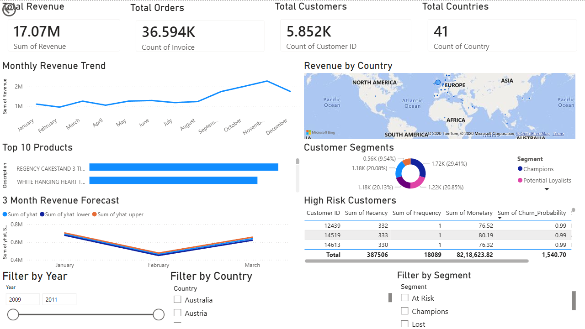

> 📥 [Download Dashboard PDF](https://github.com/KIRAN4003/retail-customer-intelligence/raw/main/dashboard/retail_dashboard.pdf)
---

## 🎯 Business Problem

A UK-based online retailer needed answers to these questions:

- 📈 How is revenue trending month over month?
- 🌍 Which countries & products drive the most revenue?
- 👥 Who are our most valuable customers?
- 🚨 Which customers are about to churn?
- 🔮 What will revenue look like in the next 3 months?

---

## 🔧 Tools & Technologies

| Tool | Purpose |
|---|---|
| Python + Pandas | Data cleaning & EDA |
| SQL (SQLite) | Business queries & aggregations |
| Scikit-learn | Churn prediction ML model |
| Prophet | Revenue forecasting |
| Power BI | Interactive dashboard |
| Matplotlib + Seaborn | Data visualization |

---

## 📂 Project Structure
retail-customer-intelligence/
│
├── notebooks/
│   ├── 01_cleaning.ipynb       ← Data cleaning
│   ├── 02_eda.ipynb            ← Exploratory analysis
│   ├── 03_sql.ipynb            ← SQL business queries
│   ├── 04_rfm.ipynb            ← Customer segmentation
│   ├── 05_ml.ipynb             ← Churn prediction
│   └── 06_forecasting.ipynb    ← Revenue forecasting
│
├── data/cleaned/
│   ├── rfm_segments.csv        ← RFM output
│   ├── rfm_with_churn.csv      ← Churn predictions
│   └── forecast_results.csv    ← Prophet forecast
│
├── dashboard/
│   ├── retail_dashboard.pbix   ← Power BI file
│   ├── retail_dashboard.pdf    ← Exported PDF
│   └── dashboard_screenshot.png
│
└── README.md

---

## 📋 Project Phases

### 🧹 Phase 1 — Data Cleaning
**Notebook:** `01_cleaning.ipynb`

- Loaded 1,067,371 raw transactions
- Removed null Customer IDs, cancellations (Invoice starting with C)
- Removed non-product entries (POST, DOT, AMAZONFEE etc)
- Removed negative quantities and zero prices
- Removed duplicate rows
- Created Revenue column (Quantity × Price)
- Extracted time features — Year, Month, Day, Hour, Quarter

**Result:** 776,577 clean rows · 0 nulls · 0 duplicates

---

### 📊 Phase 2 — Exploratory Data Analysis
**Notebook:** `02_eda.ipynb`

Answered 8 business questions with charts:

| Question | Finding |
|---|---|
| Monthly revenue trend? | November peak — holiday season spike |
| Best performing year? | 2011 showed consistent growth |
| Top country by revenue? | United Kingdom — 90%+ of revenue |
| Top product? | Regency Cakestand 3 Tier |
| Best day of week? | Thursday — B2B bulk buyers |
| Peak hour? | 12:00 PM — lunch hour ordering |
| Quarterly performance? | Q4 consistently outperforms |
| Top customer revenue? | £580,987 from single customer |

#### EDA Charts

| Monthly Revenue Trend | Revenue by Year |
|---|---|
| 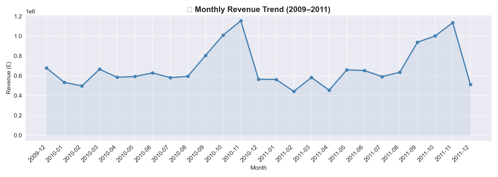 | 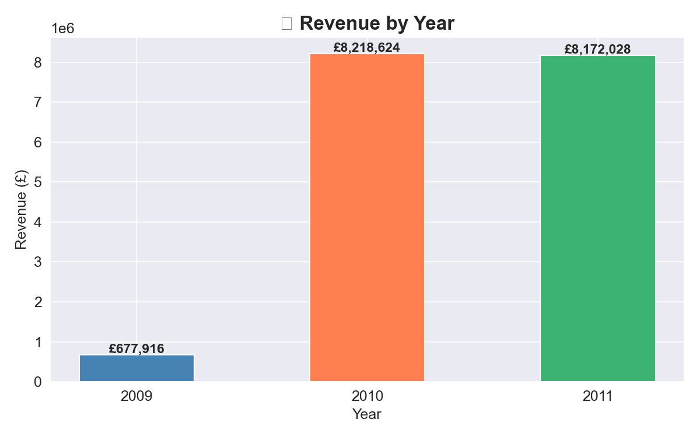 |

| Top Countries | Top Products |
|---|---|
| 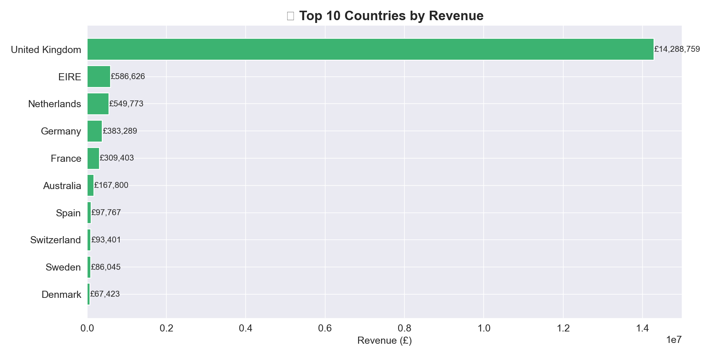 | 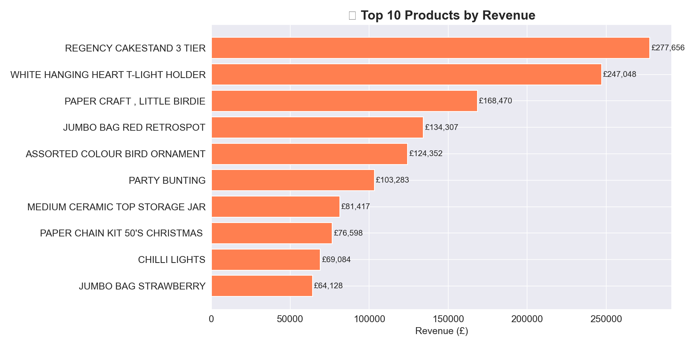 |

| Revenue by Day | Revenue by Hour |
|---|---|
| 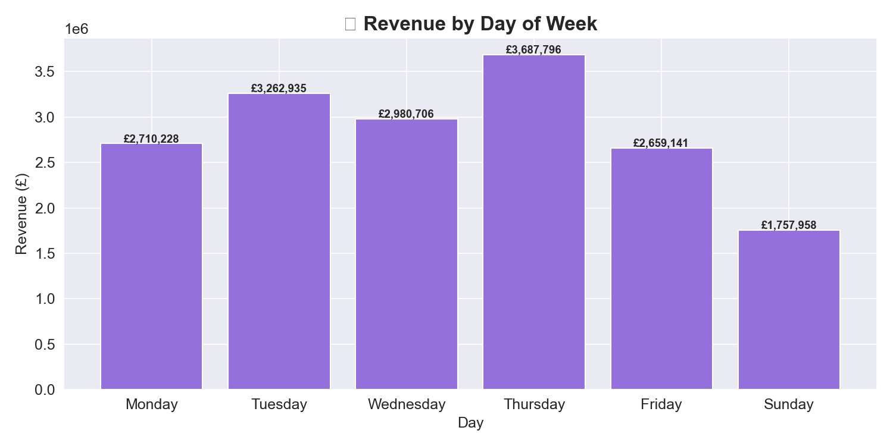 | 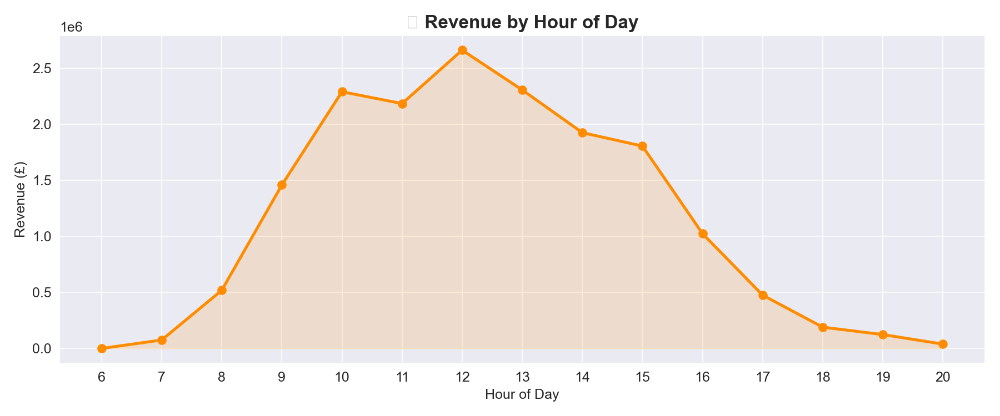 |

| Top Customers | Quarterly Revenue |
|---|---|
| 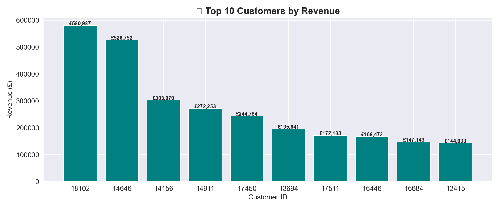 | 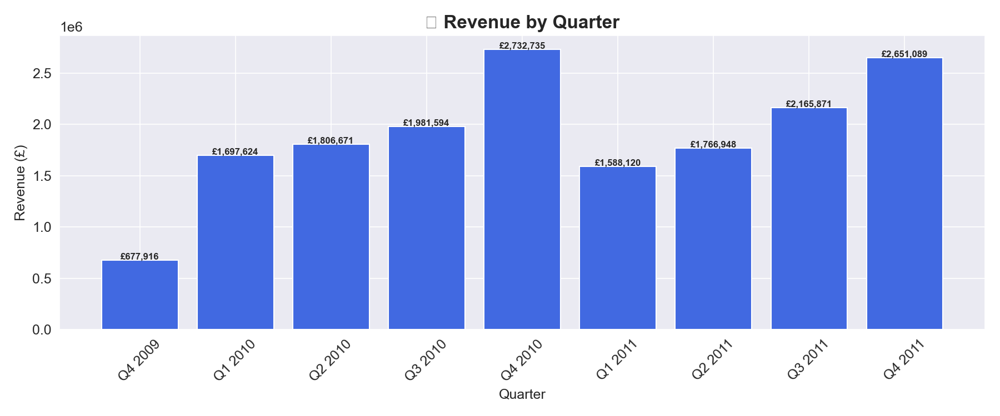 |

---

### 🗄️ Phase 3 — SQL Analysis
**Notebook:** `03_sql.ipynb`

Loaded cleaned data into SQLite and wrote 10 business queries:

- Overall revenue, orders, customers summary
- Month over month revenue growth %
- Top 10 customers by lifetime value
- Revenue & percentage contribution by country
- Top 10 products by revenue
- Revenue heatmap by Day vs Hour
- Quarterly performance tracking
- Customer purchase frequency distribution
- Average order value by country
- Monthly active customer tracking

#### SQL Heatmap — Day vs Hour
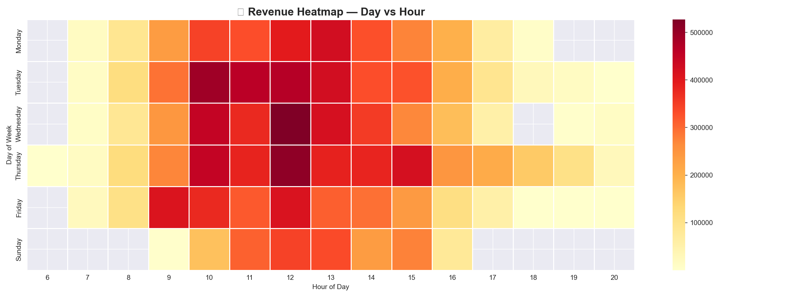

#### Monthly Active Customers
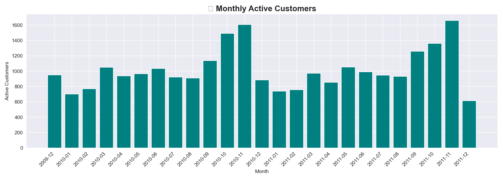

---

### 👥 Phase 4 — RFM Customer Segmentation
**Notebook:** `04_rfm.ipynb`

Segmented 5,852 customers using RFM analysis:
- **Recency** — days since last purchase
- **Frequency** — number of orders
- **Monetary** — total spend

#### Results

| Segment | Customers | Revenue | % of Total |
|---|---|---|---|
| 🟢 Champions | 1,721 | £13,708,112 | 80.3% |
| 🔵 Loyal Customers | 1,178 | £1,908,786 | 11.2% |
| 🟡 Potential Loyalists | 1,220 | £946,832 | 5.5% |
| 🟠 At Risk | 1,175 | £407,390 | 2.4% |
| 🔴 Lost | 558 | £97,446 | 0.6% |

#### Key Insight
> *Top 29% of customers (Champions) generate 80% of total revenue —
> Pareto Principle confirmed in real retail data.*

| Segment Distribution | Revenue by Segment |
|---|---|
| 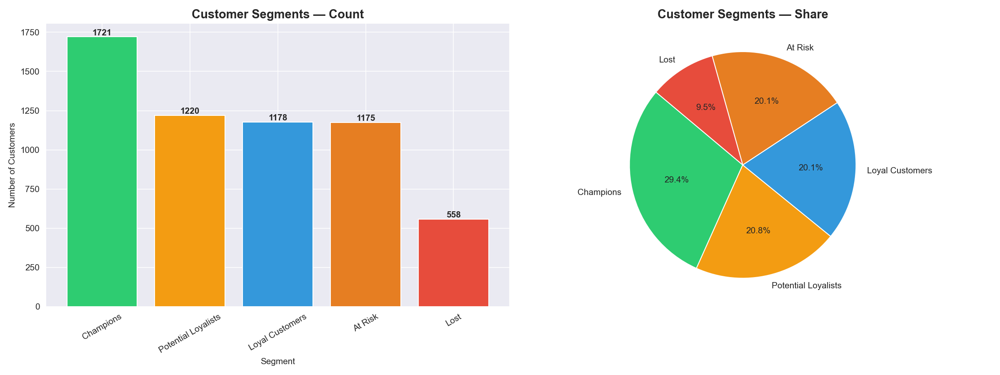 | 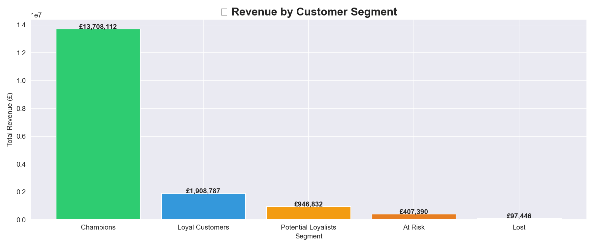 |

---

### 🤖 Phase 5 — ML Churn Prediction
**Notebook:** `05_ml.ipynb`

**Approach:** Time-based churn definition to avoid data leakage
- Train period → 2010 customer behavior (RFM features)
- Target period → Did customer return in 2011?

#### Model Results

| Model | Accuracy | AUC Score |
|---|---|---|
| Logistic Regression | **70.39%** | **0.7714** |
| Random Forest | 68.2% | 0.7102 |

**Best Model:** Logistic Regression
**Churn Rate:** 36.84% of 2010 customers didn't return in 2011
**High Risk Customers Identified:** 313
**Top Churn Driver:** Monetary value

| Churn Distribution | Model Comparison |
|---|---|
| 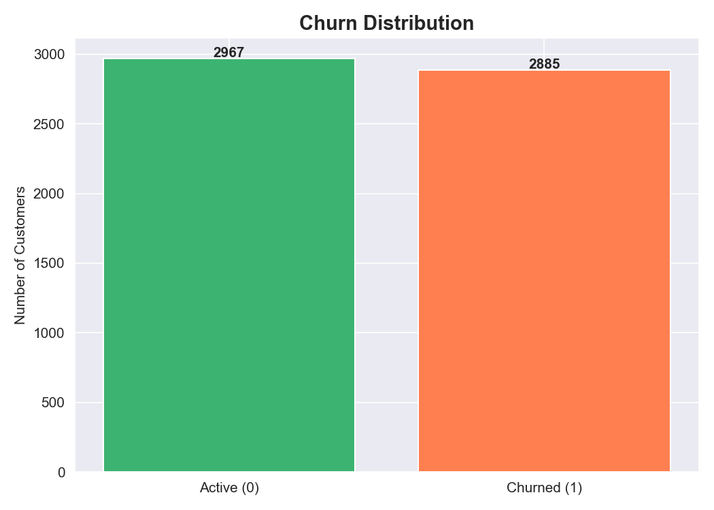 | 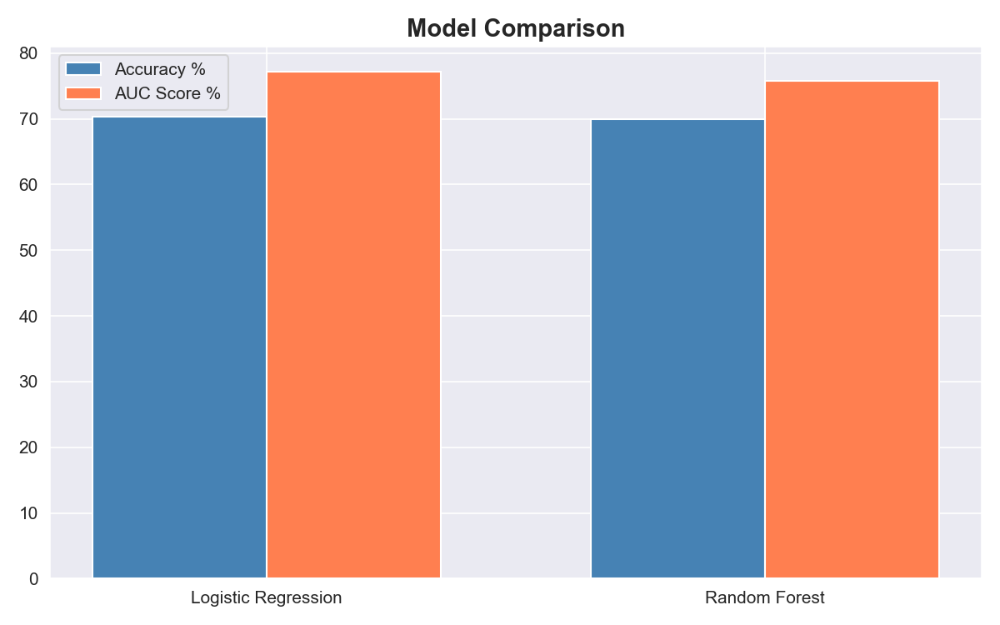 |

| Confusion Matrix | Feature Importance |
|---|---|
| 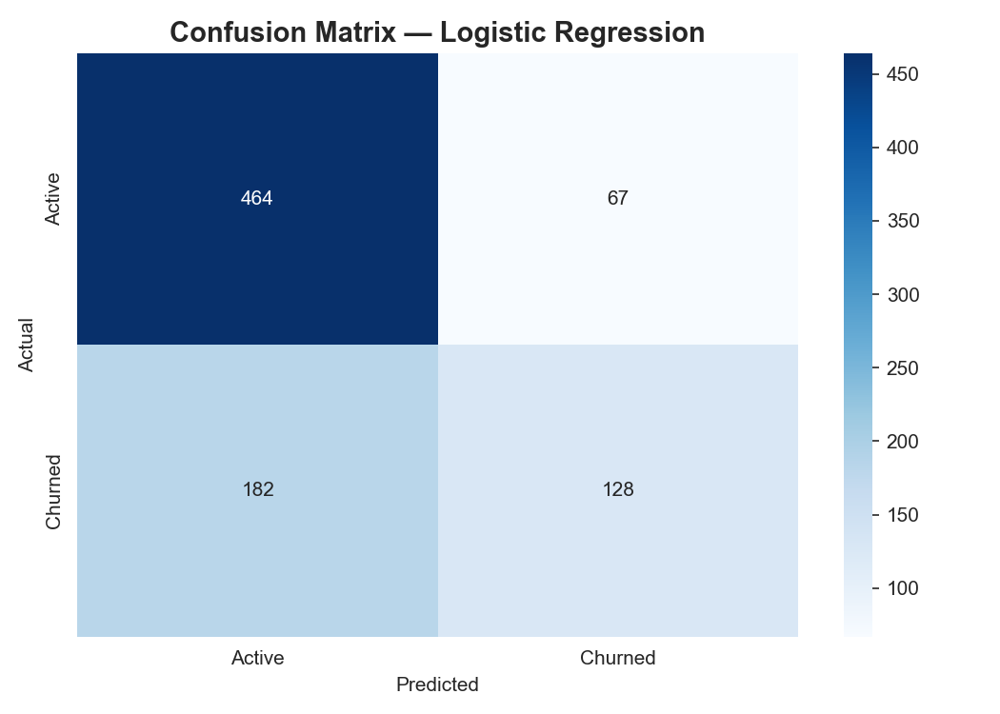 | 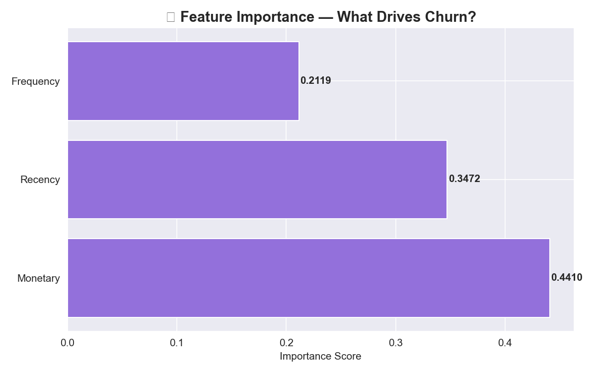 |

| ROC Curve |
|---|
| 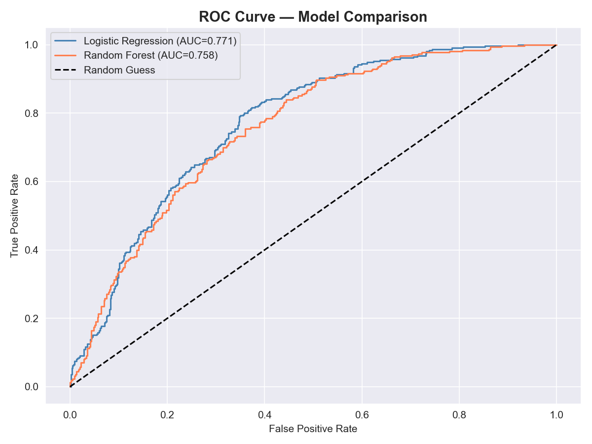 |

---

### 📈 Phase 6 — Revenue Forecasting
**Notebook:** `06_forecasting.ipynb`

Used Facebook Prophet to forecast next 3 months revenue
based on 25 months of historical data.

#### 3 Month Forecast

| Month | Predicted | Worst Case | Best Case |
|---|---|---|---|
| January 2012 | £690,209 | £677,008 | £703,706 |
| February 2012 | £462,802 | £449,447 | £476,714 |
| March 2012 | £638,703 | £621,526 | £656,027 |

#### Key Insight
> *February forecasted to drop 33% vs January —
> classic post-holiday retail slowdown.
> Recommended promotional campaign to offset seasonal dip.*

| Historical Revenue | Forecast |
|---|---|
| 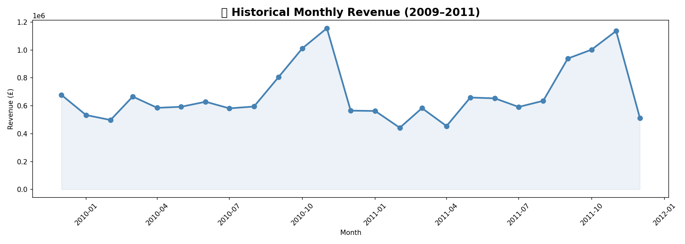 | 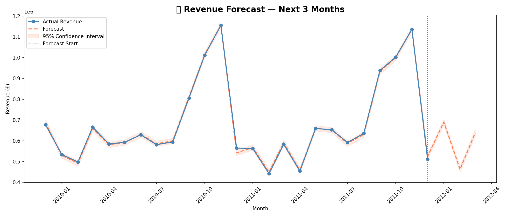 |

| Trend & Seasonality Components |
|---|
| 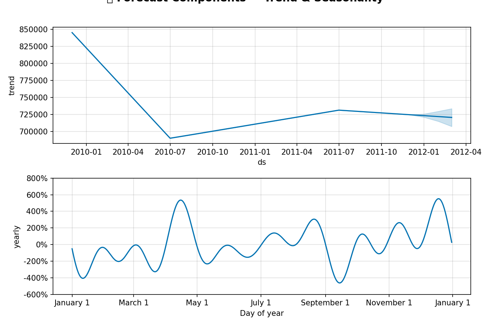 |

---

### 📊 Phase 7 — Power BI Dashboard
**File:** `dashboard/retail_dashboard.pbix`

Built an interactive Power BI dashboard with:

- 4 KPI Cards — Revenue, Orders, Customers, Countries
- Monthly Revenue Trend Line Chart
- Revenue by Country Map Visual
- Top 10 Products Bar Chart
- Customer Segments Donut Chart
- 3 Month Revenue Forecast Chart
- High Risk Customers Churn Table
- 3 Slicers — Year, Country, Segment

> 📥 [Download Full Dashboard PDF](dashboard/retail_dashboard.pdf)

---

## 💡 Business Recommendations

**1. 🏆 Protect Champions**
> 1,721 customers drive 80% of £17M revenue.
> Launch loyalty rewards & early access program immediately.
> Losing even 10% of Champions = £1.37M revenue loss.

**2. 🚨 Win Back At-Risk Customers**
> 1,175 at-risk customers represent £407,390 in at-risk revenue.
> Send targeted discount campaigns before they leave permanently.

**3. 📈 Convert Potential Loyalists**
> 1,220 customers are one good offer away from becoming Loyal.
> Converting 30% would add £2.8L to annual revenue.

**4. 📅 Prepare For February Dip**
> Revenue forecasted to drop 33% in February 2012.
> Plan clearance sales & email promotions for February.

**5. ⏰ Target Thursday Afternoons**
> Peak orders on Thursday 12PM suggests B2B buyers.
> Schedule marketing emails for Wednesday evening.

**6. 🌍 Expand Beyond UK**
> UK contributes 90%+ of revenue — dangerous concentration.
> Germany & France show growth potential — invest in EU marketing.

---

## 📌 Dataset

- **Source:** Online Retail II — UCI Machine Learning Repository
- **Kaggle:** kaggle.com/datasets/mashlyn/online-retail-ii-uci
- **Raw Size:** 1,067,371 rows × 8 columns
- **Cleaned Size:** 776,577 rows × 15 columns

> ⚠️ Raw and cleaned datasets not included due to file size.
> Download from Kaggle and run `01_cleaning.ipynb` to generate.

---
## 👤 Author

**Kiran U**
Aspiring Data Analyst & Data Scientist

- 📧 kirankiranu791@gmail.com
- 💼 [LinkedIn](https://www.linkedin.com/in/kiran-u-471818325/)
- 🐙 [GitHub](https://github.com/KIRAN4003)
---

⭐ **If you found this project helpful, please star the repository!**
